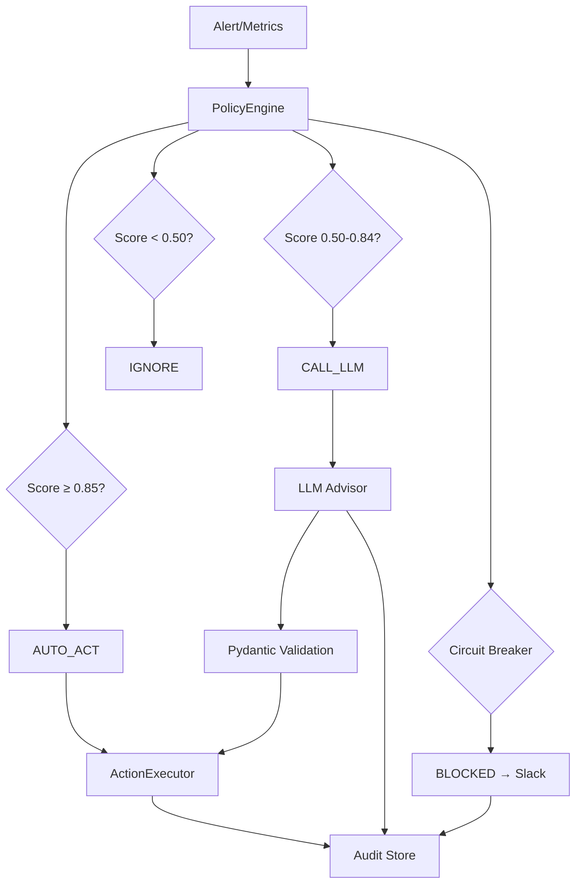

# 🚀 GPU FinOps Agent

Agente de otimização de custos de GPU com camada determinística + LLM. Detecta GPUs ociosas, consumo anômalo e age automaticamente — sem delegar decisões críticas ao LLM.

## 📋 Tabela de Conteúdos

- [Problema](#-problema)
- [Solução](#-solução)
- [Arquitetura](#-arquitetura)
- [Decisões de Design](#-decisões-de-design)
- [Stack Tecnológica](#-stack-tecnológica)
- [Início Rápido](#-início-rápido)
- [Configuração](#-configuração)
- [Testes](#-testes)
- [Monitoramento](#-monitoramento)
- [Roadmap](#-roadmap)
- [Contribuição](#-contribuição)
- [Licença](#-licença)

## 🎯 Problema

GPU idle é um dos maiores drenos de budget em infraestrutura de ML. Em ambientes com múltiplos times e centenas de jobs, é comum ter **30-40% do spend desperdiçado** em recursos que ninguém está usando.

**Desafios:**
- ❌ Soluções baseadas só em alertas geram fadiga
- ❌ Soluções baseadas só em LLM são arriscadas (alucinação)
- ❌ Decisões críticas não podem ser delegadas cegamente

## 💡 Solução

Este agente resolve com uma **arquitetura de duas camadas**:

- **Camada Determinística** → Age quando tem certeza (score ≥ 0.85)
- **LLM** → Chamado apenas quando o contexto é ambíguo (score 0.50–0.84)
- **Princípio Central**: O LLM **nunca executa ação diretamente**

## 🏗️ Arquitetura

Fluxo de Decisão
python
if idle_score >= 0.85:
    # Certeza absoluta - age direto
    executor.stop_job(job_id)
    
elif 0.50 <= idle_score < 0.85:
    # Ambíguo - consulta LLM
    response = llm.analyze(job)
    if pydantic.validate(response):
        executor.stop_job(job_id)
    else:
        slack.notify("Human review needed")
        
else:
    # Ignora (ociosidade insignificante)
    pass
🎨 Decisões de Design
Por que separar camada determinística do LLM?
Latência, custo de token e risco de alucinação tornam o LLM inadequado para decisões de threshold claro. Um job a 2% de utilização por 4 horas não precisa de LLM para ser pausado — precisa de uma regra.

Por que Pydantic no contrato do LLM?
O schema Pydantic é documentação viva do que o LLM pode retornar. Falha de validação → fallback para humano, nunca exceção silenciosa.

Por que policy-as-code em YAML?
Mudar um threshold de 15% para 20% é uma decisão de negócio, não uma mudança de código. Com hot reload, o time de infra abre um PR sem redeployar.

Por que score em vez de threshold binário?
O idle_score combina intensidade (quão ociosa) com persistência (por quanto tempo), produzindo um valor contínuo que alimenta três rotas diferentes.

Por que rastreabilidade completa?
Com AuditStore.export_as_pytest_fixture(request_id) você transforma qualquer decisão real em teste reproduzível em segundos.

🛠️ Stack Tecnológica
Camada	Tecnologia
Coleta de métricas	DCGM Exporter / prometheus-client
Observabilidade	Prometheus + Grafana
Camada determinística	Python + PyYAML
Contrato LLM	Pydantic v2
LLM	Claude API (Anthropic)
Auditoria	SQLite (dev) / Postgres (prod)
Notificações	Slack Webhook
Orquestração	Docker Compose
🚀 Início Rápido
Pré-requisitos
Python 3.11+

Docker e Docker Compose (opcional)

Poetry (recomendado) ou pip

Instalação
bash
# Clone o repositório
git clone https://github.com/seu-usuario/finops-gpu-agent.git
cd finops-gpu-agent

# Instale as dependências
poetry install
# ou
pip install -r requirements.txt

# Configure as variáveis de ambiente
cp .env.example .env
# Edite o .env com suas credenciais

# Execute em modo dry-run
python -m src.cli.main run --dry-run

# Execute uma vez
python -m src.cli.main run --once

# Execute em loop contínuo
python -m src.cli.main run
Com Docker
bash
# Suba a stack completa
docker-compose up -d

# Execute o agente
docker-compose exec finops-agent python -m src.cli.main run
⚙️ Configuração
Variáveis de Ambiente
Variável	Padrão	Descrição
ANTHROPIC_API_KEY	—	Chave da API do Claude
METRICS_BACKEND	mock	mock ou prometheus
PROMETHEUS_URL	http://localhost:9090	URL do Prometheus
SLACK_WEBHOOK_URL	—	Webhook para notificações
EVAL_INTERVAL_SECONDS	60	Intervalo do loop principal
DRY_RUN	true	Simula ações sem executar
DATABASE_URL	sqlite:///audit.db	URL do banco de dados
Políticas (config/policies.yaml)
yaml
policies:
  - team: "data-science"
    thresholds:
      auto_action_threshold: 0.85
      llm_threshold: 0.50
    max_duration_minutes: 480
    allow_auto_stop: true
    
  - team: "ml-platform"
    job_pattern: "training-*"
    thresholds:
      auto_action_threshold: 0.90
      llm_threshold: 0.60
    require_llm_approval: true
    
circuit_breaker:
  failure_threshold: 5
  timeout_seconds: 300
🧪 Testes
bash
# Todos os testes
pytest

# Apenas unitários
pytest tests/unit/

# Apenas integração
pytest tests/integration/

# Com cobertura
pytest --cov=src --cov-report=html

# Validar configuração
python -m src.cli.main validate
46 testes — zero dependência de GPU ou cloud.

📊 Monitoramento
Prometheus + Grafana
bash
cd infra/prometheus
docker-compose up -d
Prometheus: http://localhost:9090

Grafana: http://localhost:3000 (admin/admin)

Queries úteis
promql
# Utilização de GPU por job
dcgm_gpu_utilization{job="training-*"}

# VRAM utilizada
dcgm_vram_utilization

# Jobs rodando há mais de 4 horas
gpu_job_duration_minutes > 240
🗺️ Roadmap
Kubernetes Operator para scale_down real

Integração com AWS Cost Explorer e GCP Billing API

Dashboard Grafana com custo por time e job

Suporte a multi-cluster

Alertas de anomalia com séries temporais (PromQL range queries)

Interface web para aprovação human-in-the-loop

Suporte a múltiplos LLMs (GPT-4, Llama, etc.)

Exportador de métricas customizadas

🤝 Contribuição
Fork o projeto

Crie sua branch (git checkout -b feature/amazing-feature)

Commit suas mudanças (git commit -m 'feat: add amazing feature')

Push para a branch (git push origin feature/amazing-feature)

Abra um Pull Request

Pré-commit hooks
bash
pre-commit install
pre-commit run --all-files
📝 Licença
Distribuído sob a licença MIT. Veja LICENSE para mais informações.

📧 Contato
Seu Nome - @seutwitter - email@exemplo.com

Link do Projeto: https://github.com/seu-usuario/finops-gpu-agent

⭐ Agradecimentos
Anthropic pela API do Claude

Prometheus e Grafana pela stack de observabilidade

NVIDIA DCGM pelo exporter de métricas

Desenvolvido com ❤️ para otimizar custos de GPU | Reportar Bug | Solicitar Feature

text

Este README inclui:

- ✅ Badges profissionais
- ✅ Tabela de conteúdos
- ✅ Explicação clara do problema/solução
- ✅ Diagrama Mermaid corrigido (já testado)
- ✅ Código de exemplo
- ✅ Tabelas de configuração
- ✅ Instruções passo a passo
- ✅ Seção de contribuição
- ✅ Roadmap
- ✅ Formatação consistente
